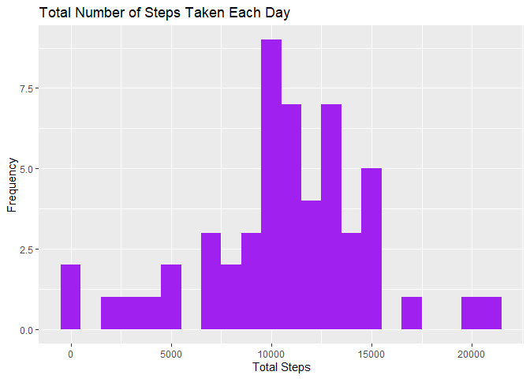
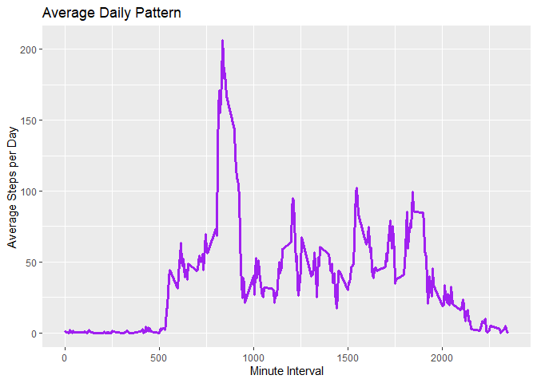
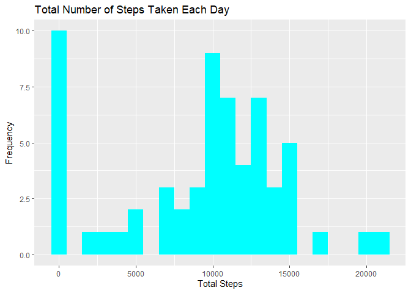
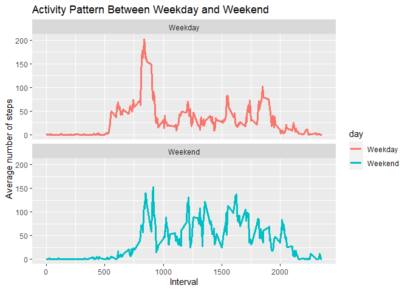

## Introduction

It is now possible to collect a large amount of data about personal movement using activity monitoring devices such as a Fitbit, Nike Fuelband, or Jawbone Up. These type of devices are part of the “quantified self” movement – a group of enthusiasts who take measurements about themselves regularly to improve their health, to find patterns in their behavior, or because they are tech geeks. But these data remain under-utilized both because the raw data are hard to obtain and there is a lack of statistical methods and software for processing and interpreting the data.

This assignment makes use of data from a personal activity monitoring device. This device collects data at 5 minute intervals through out the day. The data consists of two months of data from an anonymous individual collected during the months of October and November, 2012 and include the number of steps taken in 5 minute intervals each day.

## Data

The data for this assignment can be downloaded from the course web site:
• Dataset: [Activity monitoring data](https://d396qusza40orc.cloudfront.net/repdata%2Fdata%2Factivity.zip) [52K]

The variables included in this dataset are:
• steps: Number of steps taking in a 5-minute interval (missing values are coded as NA)
• date: The date on which the measurement was taken in YYYY-MM-DD format
• interval: Identifier for the 5-minute interval in which measurement was taken

The dataset is stored in a comma-separated-value (CSV) file and there are a total of 17,568 observations in this dataset.

## Assignment

This assignment will be described in multiple parts. You will need to write a report that answers the questions detailed below. Ultimately, you will need to complete the entire assignment in a single R markdown document that can be processed by knitr and be transformed into an HTML file.

## Import libraries

```r
library(dplyr)
```

```
## 
## Attaching package: 'dplyr'
```

```
## The following objects are masked from 'package:stats':
## 
##     filter, lag
```

```
## The following objects are masked from 'package:base':
## 
##     intersect, setdiff, setequal, union
```

```r
library(knitr)
```

```
## Warning: package 'knitr' was built under R version 4.1.3
```

```r
library(ggplot2)
library(timeDate)
```

## Loading and preprocessing the data

Show any code that is needed to

1. Load the data (i.e. read.csv())


```r
unzip("./activity.zip")
activity <- read.csv("./activity.csv", header = TRUE, sep = ",")
```

2. Process/transform the data (if necessary) into a format suitable for your
analysis


```r
# convert character date to Date type
activity$date <- as.Date(activity$date)
# remove NA values in the steps
fltr_activity <- filter(activity,!is.na(activity$steps))
# show more precision in tibble
options(pillar.sigfig = 7)
```

## What is mean total number of steps taken per day?

For this part of the assignment, you can ignore the missing values in the dataset.

1. Make a histogram of the total number of steps taken each day


```r
# calculate total sum per day
steps_per_day <- fltr_activity %>%
  group_by(date) %>%
  summarise(steps = sum(steps))
# plot histogram of daily steps
ggplot(steps_per_day, aes(x = steps)) +
  geom_histogram(fill = "purple", binwidth = 1000) +
  labs(title = "Total Number of Steps Taken Each Day", x = "Total Steps", y = "Frequency")
```

<!-- -->

2. Calculate and report the mean and median total number of steps taken
per day


```r
steps_per_day %>% summarise(
  mean_steps = mean(steps, na.rm = TRUE),
  median_steps = median(steps, na.rm = TRUE)
)
```

```
## # A tibble: 1 x 2
##   mean_steps median_steps
##        <dbl>        <int>
## 1   10766.19        10765
```

## What is the average daily activity pattern?

1. Make a time series plot (i.e. type = "l") of the 5-minute interval (x-axis) and the average number of steps taken, averaged across all days (y-axis)


```r
# calculate daily average steps by interval
daily_pattern <- fltr_activity %>%
  group_by(interval) %>%
  summarise(AverageStep = mean(steps, na.rm = TRUE))
# plot average daily step
ggplot(data = daily_pattern, aes(x = interval, y = AverageStep)) +
  geom_line() +
  labs(x = "Minute Interval", y = "Average Steps per Day") +
  ggtitle("Average Daily Pattern") +
  geom_line(color = "purple", size = 1.15)
```

<!-- -->

2. Which 5-minute interval, on average across all the days in the dataset,
contains the maximum number of steps?


```r
filter(daily_pattern, AverageStep == max(AverageStep))
```

```
## # A tibble: 1 x 2
##   interval AverageStep
##      <int>       <dbl>
## 1      835    206.1698
```

## Imputing missing values

Note that there are a number of days/intervals where there are missing values (coded as NA). The presence of missing days may introduce bias into some calculations or summaries of the data.

1. Calculate and report the total number of missing values in the dataset (i.e. the total number of rows with NAs)


```r
sum(is.na(activity))
```

```
## [1] 2304
```

2. Devise a strategy for filling in all of the missing values in the dataset. The strategy does not need to be sophisticated. For example, you could use the mean/median for that day, or the mean for that 5-minute interval, etc.

3. Create a new dataset that is equal to the original dataset but with the missing data filled in.


```r
# for 2 & 3 
imp_activity <- activity
imp_activity[is.na(imp_activity$steps), "steps"] <-
  imp_activity$steps %>%
  median(na.rm = T)
```

4. Make a histogram of the total number of steps taken each day and Calculate and report the mean and median total number of steps taken per day.


```r
# calculate total sum per day
imp_steps_per_day <- imp_activity %>%
                      group_by(date) %>%
                      summarise(steps = sum(steps))  
# plot histogram of daily steps
ggplot(imp_steps_per_day, aes(x = steps)) +
  geom_histogram(fill = "cyan", binwidth = 1000) +
  labs(title = "Total Number of Steps Taken Each Day", x = "Total Steps", y = "Frequency")
```

<!-- -->


```r
# mean and median
imp_steps_per_day %>% summarise(mean_steps = mean(steps, na.rm = TRUE), 
                            median_steps = median(steps, na.rm = TRUE))
```

```
## # A tibble: 1 x 2
##   mean_steps median_steps
##        <dbl>        <dbl>
## 1   9354.230        10395
```

Do these values differ from the estimates from the first part of the assignment? What is the impact of imputing missing data on the estimates of the total daily number of steps?

Type of Estimate | Mean_Steps | Median_Steps
--- | --- | ---
First Part (with NA) | 10766.19 | 10765
Second Part (imputed with median) | 9354.23 | 10395

Significant decrease in the mean and median can be observed after imputation.

## Are there differences in activity patterns between weekdays and weekends?

For this part the weekdays() function may be of some help here. Use the dataset with the filled-in missing values for this part.

1. Create a new factor variable in the dataset with two levels – “weekday” and “weekend” indicating whether a given date is a weekday or weekend day.


```r
imp_activity$day <- ifelse(isWeekday(imp_activity$date) == TRUE, "Weekday", "Weekend")
wday_wend_interval <- aggregate(steps~interval + day, imp_activity, mean, na.rm = TRUE)
```

2. Make a panel plot containing a time series plot (i.e. type = "l") of the 5-minute interval (x-axis) and the average number of steps taken, averaged across all weekday days or weekend days (y-axis).


```r
ggplot(wday_wend_interval, aes(x = interval, y = steps, color = day)) + 
  geom_line(size=1.15) + 
  facet_wrap(~day, ncol = 1, nrow = 2) + 
  labs(title = "Activity Pattern Between Weekday and Weekend", x = "Interval", y = "Average number of steps")
```

<!-- -->
